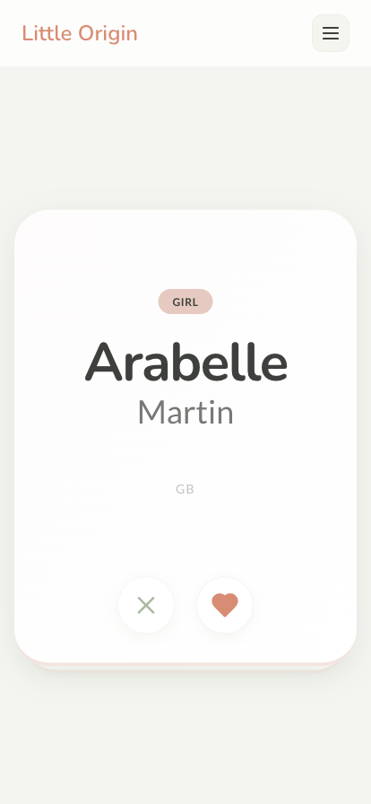

# Little Origin 👶✨

The Best Way to Choose Your Baby's Name.

[About](#-about) • [Features](#-features) • [Screenshots](#-screenshots) • [Getting Started](#-getting-started) • [Tech Stack](#-tech-stack) • [Architecture](#-architecture) • [Documentation](https://nightbr.github.io/little-origin/)

"A name is the first gift a parent gives a child."

---

## 📖 About

**Little Origin** is a polished, high-performance application designed to help couples find the perfect name for their baby. Inspired by the convenience of swipe-based interfaces, it simplifies the overwhelming world of baby names into a collaborative and delightful experience.

## ✨ Features

- **🎯 Curated Swipe Interface**: High-quality name cards with gesture-driven interactions (Framer Motion).
- **💓 Real-time Matching**: Instant notifications when you and your partner both "Like" a name.
- **🌍 Global Name Sourcing**: Integrated static data and API access to names from over 7 countries.
- **🔐 Data Security**: Self-hosted solution with secure authentication (JWT + Argon2).

## 📸 Screenshots

<p align="center">
  
  &nbsp;
  
  &nbsp;
  
</p>

<p align="center">
  <em>Swipe through names, get notified in real time when you both like the same one, and review your matches.</em>
</p>

More screenshots in the [documentation](https://nightbr.github.io/little-origin/).

## 🚀 Getting Started

### Prerequisites

- [Node.js](https://nodejs.org/) >= 24 (or use mise to install it)
- [pnpm](https://pnpm.io/) >= 10
- [mise](https://mise.jdx.dev/) (recommended)

### Installation

1. **Install Dependencies**

   ```bash
   pnpm install
   ```

2. **Configure Environment**
   Create a `.env` file at the root:

   ```env
   JWT_SECRET=your_very_secret_key_here
   ```

3. **Start Development**

   ```bash
   pnpm run dev
   ```

   The first run will automatically build all packages before starting the dev servers.

   - **Web**: http://localhost:3001
   - **API**: http://localhost:3000/graphql

## 🛠 Tech Stack

### Frameworks & Libraries

- **Frontend**: [React](https://react.dev/) + [Vite](https://vitejs.dev/) + [Tailwind CSS](https://tailwindcss.com/)
- **Backend**: [Express](https://expressjs.com/) + [Apollo Server](https://www.apollographql.com/docs/apollo-server/)
- **Database**: [SQLite](https://www.sqlite.org/) + [Drizzle ORM](https://orm.drizzle.team/)
- **Gestures**: [Framer Motion](https://www.framer.com/motion/)
- **Real-time**: [GraphQL Subscriptions](https://www.apollographql.com/docs/apollo-server/data/subscriptions/)

### Tooling (Modern Monorepo)

- **Runtime**: [Mise](https://mise.jdx.dev/) (Node 24, pnpm)
- **Monorepo**: [Turborepo](https://turbo.build/repo)
- **Logic & Validation**: [Zod](https://zod.dev/)
- **Linting & Formatting**: [Biome](https://biomejs.dev/)
- **Dependency Management**: [Syncpack](https://github.com/JamieMason/syncpack) & [Knip](https://knip.dev/)

## 🏗 Architecture

The project follows a modular monorepo structure:

```txt
├── apps/
│   ├── web/          # React + Vite frontend
│   └── api/          # Express + Apollo backend
├── packages/
│   ├── core/         # Shared DB schemas (Drizzle), types, and constants
│   └── name-data/    # Static name data loader and JSON assets
├── .data/            # SQLite database storage (ignored by git)
└── specs/            # Technical documentation and plans
```

---

Built with ❤️ for future parents.
